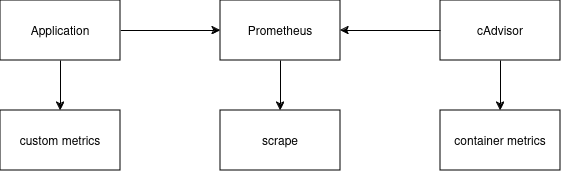

# Custom Metrics Implementation with cAdvisor

## Findings

cAdvisor provides system-level metrics about Docker containers, but lacks the ability to expose custom application-specific metrics

This is addressed by creating a custom metrics exporter, which exposes these metrics in a format that Prometheus can scrape

* cAdvisor provides container-level metrics.
* Custom Metrics Exporter provides application-level metrics.
* Prometheus scrapes both metrics.

## Architecture



## Prometheus Client Setup

Ensure the appropriate Prometheus client is used. This will expose metrics that Prometheus can scrape.

```plaintext
# backend-app/requirements.txt
prometheus-client==0.19.0
```

## Metrics Definition

Define custom metrics in the application code:

```python
# backend-app/app/metrics.py
from prometheus_client import Counter, Histogram, generate_latest, CONTENT_TYPE_LATEST
from flask import Response

# Custom metric definitions
webhook_requests_total = Counter(
    'webhook_requests_total', 'Total number of webhook requests processed', ['status']
)

webhook_processing_time = Histogram(
    'webhook_processing_time_seconds', 'Time spent processing webhook requests',
    buckets=[0.01, 0.05, 0.1, 0.5, 1.0]
)

webhook_payload_size = Counter(
    'webhook_payload_size_bytes', 'Total size of webhook payloads received'
)

# Metrics endpoint
def metrics_endpoint():
    return Response(generate_latest(), mimetype=CONTENT_TYPE_LATEST)
```

### **How It Works:**

1. **Metric Definitions**:
   * **Counter**: This metric is for counting things that only ever increase (like requests). In this case, it tracks the total number of webhook requests, broken down by their status (e.g., `success`, `failure`).
   * **Histogram**: This tracks values over time, specifically useful for measuring durations or distributions (e.g., request processing time). Here, it measures the time taken to process webhook requests.
   * **Counter for Payload Size**: Tracks the total size of the payloads received by the webhook.

2. **Exposing Metrics**:
   * The `metrics_endpoint()` function is responsible for exposing these metrics in a Prometheus-compatible format. It uses the `prometheus_client` to gather and serve all defined metrics at the `/metrics` endpoint.
   * The **Flask Response** is set with the proper MIME type (`CONTENT_TYPE_LATEST`) to make it compatible with Prometheus scraping.

3. **Metrics Exposure**:
   * The `/metrics` endpoint becomes the main endpoint that **Prometheus** will scrape to collect data. When Prometheus scrapes this endpoint, it retrieves the latest values of all defined metrics.

### **Why This Approach?**

* **Prometheus Format**: By using `prometheus_client` and the `generate_latest()` function, we ensure that the metrics are in the exact format Prometheus expects.
  
* **Separation of Concerns**: The use of a Flask app allows us to isolate the metric-serving logic. This keeps our application code clean and focused while ensuring the metrics are available at a separate endpoint.

* **Minimal Complexity**: We use simple, pre-built classes (e.g., `Counter`, `Histogram`) from the `prometheus_client` library to avoid unnecessary complexity. This allows us to stay focused on the core task of exposing metrics without overengineering the solution.

* **Flask for Simplicity**: Flask is a lightweight framework that provides all we need to expose the `/metrics` endpoint. We avoid introducing heavier frameworks, keeping the solution simple and focused on the PoC.

---

## cAdvisor Configuration

Configure cAdvisor to monitor Docker containers:

```yaml
# docker-compose.yml
cadvisor:
    image: gcr.io/cadvisor/cadvisor:v0.47.2
    container_name: cadvisor
    volumes:
      - /:/rootfs:ro
      - /var/run:/var/run:ro
      - /sys:/sys:ro
      - /var/lib/docker/:/var/lib/docker:ro
    command:
      - --docker_only=true
      - --housekeeping_interval=30s
    ports:
      - "8081:8080"
    networks:
      - app-network
```

### **Explanation of cAdvisor Configuration:**

* **Volumes**: cAdvisor requires specific system directories to access container data. These include:
  * `/rootfs`: Provides access to the entire filesystem.
  * `/var/run`, `/sys`, `/var/lib/docker`: Needed to gather metrics related to container runtime and Docker itself.

* **Command Flags**:
  * `--docker_only=true`: Instructs cAdvisor to monitor only Docker containers.
  * `--housekeeping_interval=30s`: Sets the housekeeping interval for cAdvisor to refresh container data every 30 seconds.

* **Ports**: Exposes the cAdvisor web interface on port `8081` for container metrics viewing.

---

## Prometheus Setup

Add Prometheus to scrape metrics from both the application and cAdvisor:

```yaml
# docker-compose.yml
prometheus:
    image: prom/prometheus:latest
    ports:
      - "9090:9090"
    volumes:
      - ./prometheus/prometheus.yml:/etc/prometheus/prometheus.yml
    networks:
      - app-network
```

Configure Prometheus scraping:

```yaml
# prometheus/prometheus.yml
global:
  scrape_interval: 15s

scrape_configs:
  - job_name: 'webhook'
    static_configs:
      - targets: ['webhook:5000']

  - job_name: 'cadvisor'
    static_configs:
      - targets: ['cadvisor:8080']
```

### **Explanation of Prometheus Setup:**

* **Scrape Interval**: Set to 15 seconds to pull metrics regularly.
  
* **Scrape Configurations**:
  * **Webhook job**: Prometheus scrapes metrics from the application at `http://webhook:5000/metrics`.
  * **cAdvisor job**: Prometheus scrapes metrics from cAdvisor at `http://cadvisor:8080/metrics`.

---

## Metrics Access Points

* **Application Metrics**: `http://localhost:5000/metrics`
* **cAdvisor Interface**: `http://localhost:8081`
* **Prometheus Interface**: `http://localhost:9090`

---

## Verification

Test the metrics pipeline:

1. **Generate Test Data**:

   ```bash
   python3 simulator.py http://localhost:5000/webhook mysecretkey --count 5
   ```

2. **Check Raw Metrics**:

   ```bash
   curl http://localhost:5000/metrics
   ```

   Sample output:

   ```plaintext
   # HELP webhook_requests_total Total number of webhook requests processed
   # TYPE webhook_requests_total counter
   webhook_requests_total{status="success"} 5
   ```

3. **Check in Prometheus UI**:
   1. Go to `http://localhost:9090`.
   2. Query: `webhook_requests_total`.
